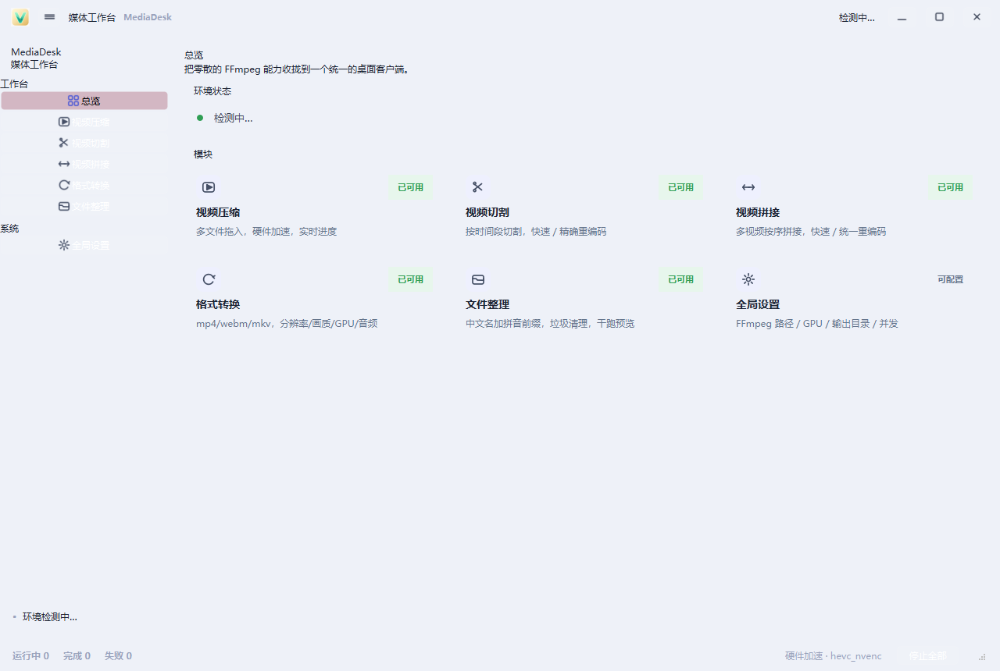
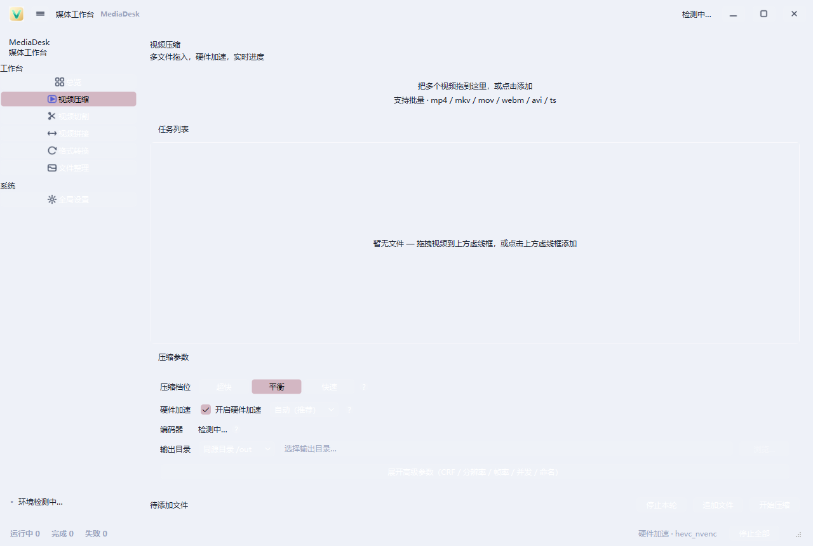
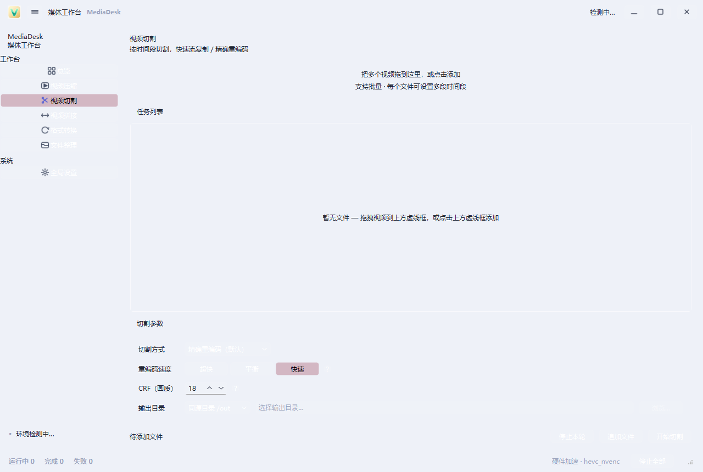
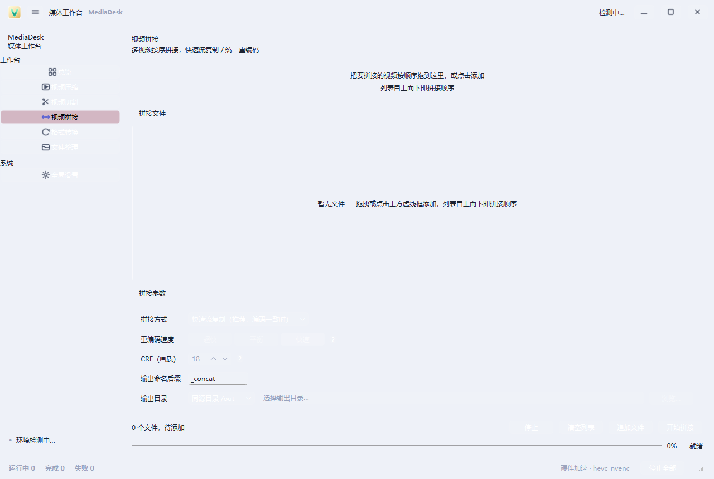
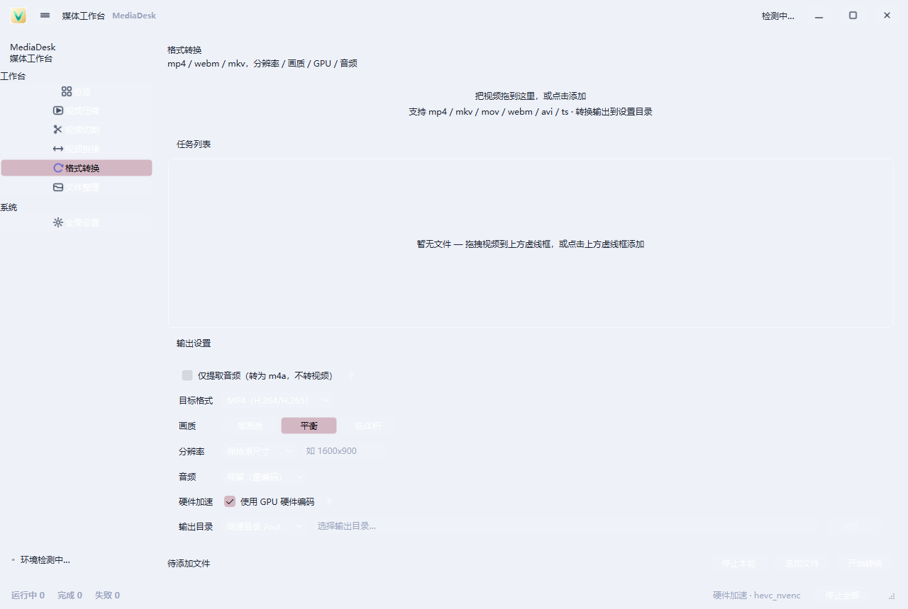
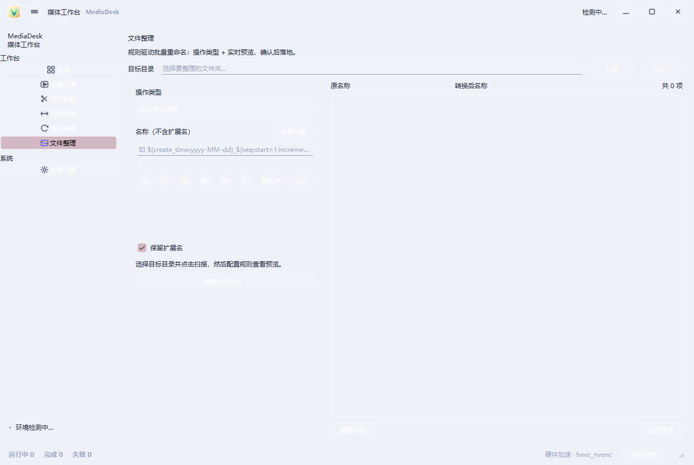
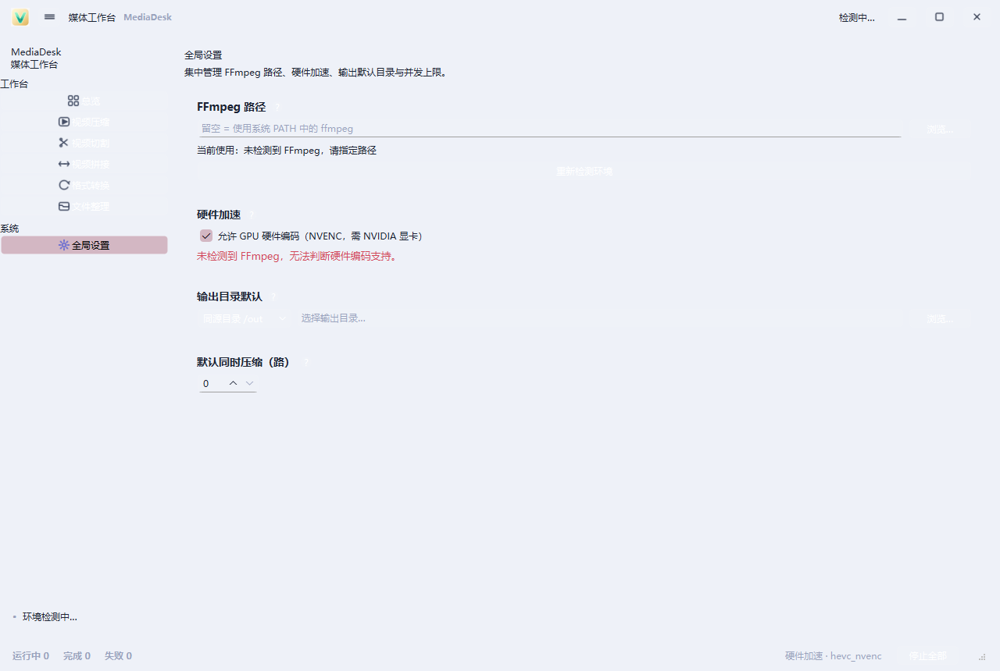

# MediaDesk 媒体工作台

把零散的 FFmpeg 能力收拢到一个统一的桌面客户端。基于 **PySide6**，提供视频压缩 / 切割 / 拼接 / 格式转换 / 文件整理 / 全局设置 六大模块，统一的浅色主题与直观的拖拽交互。

> 主要面向媒体管理与整理场景，为设计师 / 开发者提供一条龙、可视化的批量处理工作台。

## 界面一览



 

 

 

> 完整操作流程见 [docs/使用说明.md](docs/使用说明.md)。

## 功能总览

| 模块 | 说明 |
| --- | --- |
| 总览 | 环境检测（FFmpeg / GPU / 编码器）+ 模块入口 |
| 视频压缩 | 多文件拖入、硬件加速、自定义画质/分辨率、实时进度 |
| 视频切割 | 按时间段切割，支持快速 / 精确重编码，多段时间轴 |
| 视频拼接 | 多视频按序拼接，快速 / 统一重编码，排序调整 |
| 格式转换 | mp4 / webm / mkv 容器互转，分辨率/画质/GPU/音频开关，仅提取音频 |
| 文件整理 | 中文名加拼音前缀、垃圾文件清理、干跑预览 |
| 全局设置 | FFmpeg 路径 / GPU / 输出目录 / 并发上限 |

- 所有媒体页支持**拖拽添加文件**、实时进度展示、可取消任务。
- 硬件加速（GPU 编码：`hevc_nvenc` 等）与编码器选择在压缩 / 转换 / 设置各页实时同步。
- 全局**浅色主题**，不受系统深色模式影响。

## 环境要求

- **Python 3.11+**（建议 3.12）
- 操作系统：Windows 10 / 11
- 完整版 **FFmpeg**（含 `libx264` / `libx265` / `libvpx`）；启用 GPU 硬编需对应 NVENC 支持的 FFmpeg 构建

## 安装

```bash
# 1. 创建并激活虚拟环境
python -m venv .venv
.venv\Scripts\activate

# 2. 安装依赖
pip install -r requirements.txt

# 3. （可选）下载随包 FFmpeg 二进制
python scripts/fetch_ffmpeg.py
```

FFmpeg 查找优先级：**手动配置路径 > 随包 `ffmpeg/bin` > 系统 PATH**。也可在「全局设置」页手动指定。

## 运行

```bash
python main.py
```

## 打包（绿色版）

```bash
pyinstaller MediaDesk.spec
```

输出位于 `dist/`。打包时自动剔除 WebEngine / QML 等非必需组件以精简体积，并强制浅色调色板。

## 目录结构

```
.
├── main.py                 # 入口（强制浅色主题）
├── app/
│   ├── ui/                 # 各模块界面（压缩/切割/拼接/转换/整理/设置）
│   ├── core/ + task.py     # 业务逻辑与任务池（进度/取消统一管理）
│   └── config.py           # 配置（子配置管理）
├── ffmpeg/                 # 随包 FFmpeg 二进制（忽略提交）
├── legacy_scripts/         # 旧版脚本归档（含 telegram_tools 演示代码）
├── docs/                   # PRD 原型 / 设计稿 / 验收清单 / 使用说明
├── scripts/                # 工具脚本（取 FFmpeg、资源生成等）
└── tests/                  # 编译冒烟 + UI 构建检查
```

## 测试

```bash
# 冒烟测试 + UI 离屏构建检查
python tests/smoke_test.py
python tests/ui_build_check.py
```

## 安全说明

本仓库通过 `.gitignore` 排除了敏感文件与二进制产物，**切勿提交**：

- `legacy_scripts/tele_tools/.env` —— 含 Telegram 凭据
- `.venv*` / `build/` / `dist/` / `ffmpeg/` / `release/` —— 虚拟环境与构建产物

## 文档

- `docs/使用说明.md` —— 各模块操作指引
- `docs/media-desk-prd/` —— 产品需求文档
- `docs/prototype/mediadesk/index.html` —— 高保真交互原型

## License

[MIT](LICENSE) © Vitoice